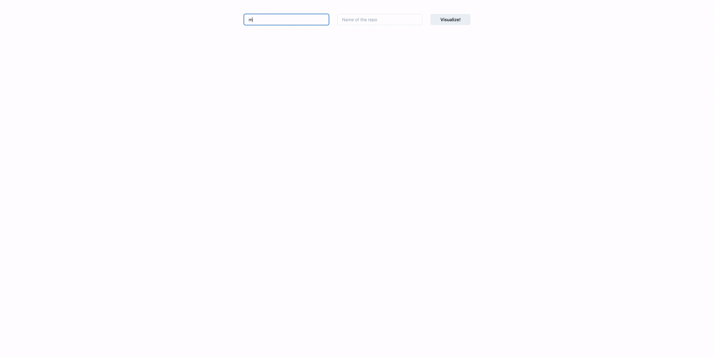

# Github Actions Stat Visualiser

Statistics for your Github Actions to help analyse and optimise your workflows.

This project provides a CLI that can be used to analyse your github actions over time.
The resulting analysis can be used to monitor the duration of workflows over time and bea valuable tool for measuring
effect of changes to the pipeline, thereby helping to find which optimisations are optimal for your actions. 

## 🌟 Features
- React App to visualise and graph stats
- List all workflows under a repo - clicking on them takes one to the analysis page of that workflow
- List all runs for a workflow (up to last 100)
- Histogram of the duration of successful runs along with basic stats about that workflows runs
- Provide stats for different workflows conclusion, e.g. success, failure, cancelled, etc

Gif of current state of the app:

Screenshot:

## Development

Create a .env file at the root with `REACT_APP_GITHUB_TOKEN` env var. Its value should be a 
personal token you create via github (it must have the necessary permission - list of these coming)  .

[Soon this app will become a github app and will automatically authenticate with github]

## How it works?

Long term: cache all fetched data and only retrieve again if not already cached.

## 🌟 Upcoming Features
- Use Formik for form logic
- Hydrate form input from localstorage
- More detailed explanation of workflow conclusion e.g. failed after how long? histograms for each different conclusion
- Provide basic stats for the given runs for a workflow, e.g. min, max, mean, 80th, 90th, 95th, 99th percentile
- List all runs for a workflow with a variable time based start window
- Number of workflows run per day (with possibility of filtering by a given workflow)
- Filtering based on the branch that workflows ran on? 
